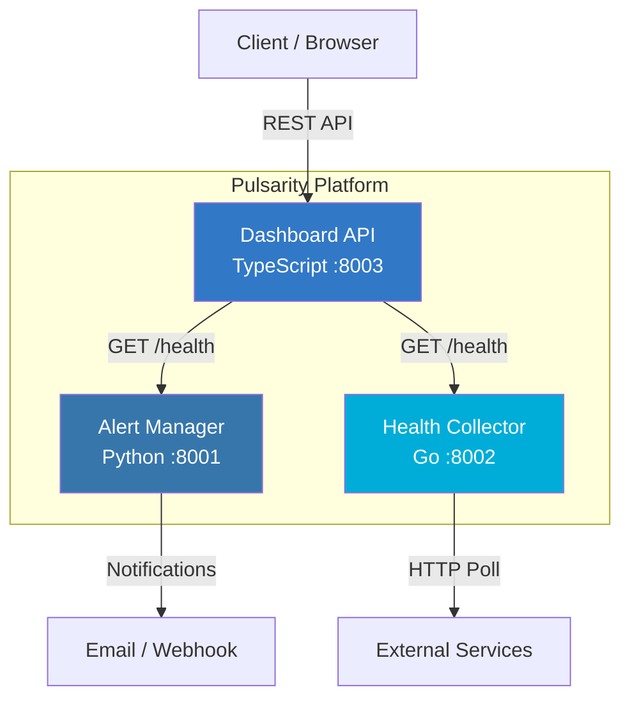

# Pulsarity

**Real-time service health monitoring and alerting platform.**

Pulsarity is a microservices-based platform that monitors the health of your services, manages alert rules, and provides a unified dashboard API for visibility into your infrastructure.

## Architecture



### Services

| Service | Language | Port | Description |
|---------|----------|------|-------------|
| **Alert Manager** | Python (Flask) | 8001 | Manages alert rules, triggers notifications |
| **Health Collector** | Go (net/http) | 8002 | High-performance endpoint health polling |
| **Dashboard API** | TypeScript (Express) | 8003 | API gateway for monitoring dashboard |

## Quick Start

### Prerequisites

- Docker & Docker Compose
- Or for local development: Python 3.12+, Go 1.22+, Node.js 20+

### Using Docker Compose

```bash
# Copy environment config
cp .env.example .env

# Start all services
make up

# View logs
make logs

# Stop all services
make down
```

### Local Development

```bash
# Run all tests
make test

# Run linters
make lint

# Run individual service tests
make test-python
make test-go
make test-ts
```

## API Reference

### Alert Manager (`:8001`)

| Method | Endpoint | Description |
|--------|----------|-------------|
| `GET` | `/health` | Health check |
| `GET` | `/alerts` | List all alert rules |
| `POST` | `/alerts` | Create a new alert rule |
| `GET` | `/alerts/:id` | Get a specific alert |
| `DELETE` | `/alerts/:id` | Delete an alert rule |
| `POST` | `/alerts/:id/trigger` | Manually trigger an alert |

**Create Alert Example:**

```bash
curl -X POST http://localhost:8001/alerts \
  -H "Content-Type: application/json" \
  -d '{
    "name": "API Health",
    "target_url": "http://myapp.com/health",
    "threshold_ms": 3000,
    "notify_email": "ops@example.com"
  }'
```

### Health Collector (`:8002`)

| Method | Endpoint | Description |
|--------|----------|-------------|
| `GET` | `/health` | Health check |
| `GET` | `/targets` | List monitored targets |
| `POST` | `/targets` | Register a new target |
| `GET` | `/targets/:id` | Get a specific target |
| `DELETE` | `/targets/:id` | Remove a target |
| `POST` | `/targets/:id/check` | Run a health check now |

**Register Target Example:**

```bash
curl -X POST http://localhost:8002/targets \
  -H "Content-Type: application/json" \
  -d '{
    "name": "My API",
    "url": "http://myapp.com/health",
    "interval_sec": 30
  }'
```

### Dashboard API (`:8003`)

| Method | Endpoint | Description |
|--------|----------|-------------|
| `GET` | `/health` | Health check |
| `GET` | `/api/dashboard/summary` | Overall system health summary |
| `GET` | `/api/services` | List all platform services |
| `GET` | `/api/config` | Current configuration |

**Dashboard Summary Example:**

```bash
curl http://localhost:8003/api/dashboard/summary
```

## Environment Variables

| Variable | Default | Description |
|----------|---------|-------------|
| `ALERT_MANAGER_PORT` | `8001` | Alert Manager service port |
| `COLLECTOR_PORT` | `8002` | Health Collector service port |
| `DASHBOARD_PORT` | `8003` | Dashboard API service port |
| `LOG_LEVEL` | `INFO` | Logging level (DEBUG, INFO, WARNING, ERROR) |
| `ALERT_MANAGER_URL` | `http://localhost:8001` | Alert Manager URL (for inter-service) |
| `COLLECTOR_URL` | `http://localhost:8002` | Health Collector URL (for inter-service) |

## Project Structure

```
pulsarity/
├── docker-compose.yml
├── Makefile
├── .env.example
├── .gitignore
├── .github/
│   └── workflows/
│       └── ci.yml
├── README.md
└── services/
    ├── alert-manager/          # Python (Flask)
    │   ├── app.py
    │   ├── test_app.py
    │   ├── requirements.txt
    │   └── Dockerfile
    ├── health-collector/       # Go (net/http)
    │   ├── main.go
    │   ├── main_test.go
    │   ├── go.mod
    │   └── Dockerfile
    └── dashboard-api/          # TypeScript (Express)
        ├── src/
        │   ├── app.ts
        │   ├── app.test.ts
        │   └── index.ts
        ├── package.json
        ├── tsconfig.json
        ├── jest.config.js
        ├── .eslintrc.json
        └── Dockerfile
```

## CI/CD

GitHub Actions CI pipeline runs on every push and PR to `main`:

1. **test-python** - Lint with flake8, test with pytest
2. **test-go** - Vet and test Go code
3. **test-typescript** - Lint with ESLint, test with Jest
4. **docker-build** - Build all Docker images (after tests pass)

> **Note:** The `.github/workflows/ci.yml` file may need to be added manually after the initial merge due to GitHub API limitations with the `.github/` directory.

<details>
<summary>CI Workflow Content (.github/workflows/ci.yml)</summary>

```yaml
name: CI

on:
  push:
    branches: [main]
  pull_request:
    branches: [main]

jobs:
  test-python:
    runs-on: ubuntu-latest
    defaults:
      run:
        working-directory: services/alert-manager
    steps:
      - uses: actions/checkout@v4
      - uses: actions/setup-python@v5
        with:
          python-version: "3.12"
      - run: pip install -r requirements.txt
      - run: flake8 --max-line-length=120 app.py test_app.py
      - run: pytest -v

  test-go:
    runs-on: ubuntu-latest
    defaults:
      run:
        working-directory: services/health-collector
    steps:
      - uses: actions/checkout@v4
      - uses: actions/setup-go@v5
        with:
          go-version: "1.22"
      - run: go vet ./...
      - run: go test -v ./...

  test-typescript:
    runs-on: ubuntu-latest
    defaults:
      run:
        working-directory: services/dashboard-api
    steps:
      - uses: actions/checkout@v4
      - uses: actions/setup-node@v4
        with:
          node-version: "20"
      - run: npm install
      - run: npx eslint 'src/**/*.ts'
      - run: npm test

  docker-build:
    runs-on: ubuntu-latest
    needs: [test-python, test-go, test-typescript]
    steps:
      - uses: actions/checkout@v4
      - run: docker compose build
```

</details>

## License

MIT
